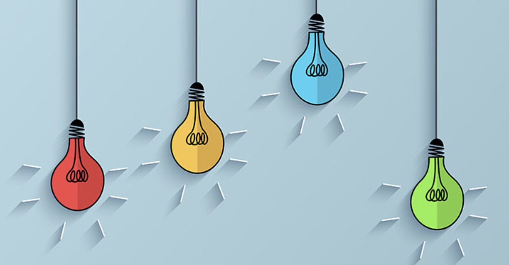

Induction — the reasoning that infers a conclusion or a rule based on observations — and deduction — the reasoning that infers a conclusion following a general rule — form the basis of analytical thinking. This highly logical type of thinking is the foundation for many types of problem solving in business, science, and engineering where the problem is framed, data is highly structured, and you need to make a clear choice on how to optimize what is in front of you. This type of reasoning is essential in both scientific and creative thinking because it relies on deciphering patterns in data, but this method of reasoning can not be applied to all problems.

Many problems are more complex than simply optimizing a dataset. These problems deal with unknown and ambiguous information, have interconnected parts, are not framed, and are centered around the fickle nature of human behavior. These are the situations where analytical thinking fails. Inductive reasoning fails because any new evidence in accordance with your assumptions reinforces them and any evidence that contradicts your assumptions is considered to be an anomaly. Deductive reasoning fails because you assume that you already know everything and no further explanation or investigation is needed. Neither inductive nor deductive reasoning provides a framework for dealing with new information ambiguity, and uncertainty.

The inherent imperfections of analytical thinking are a hindrance to creativity and the development and implementation of new ideas. Uncertainty and ambiguity do not go away because they are accounted as anomalies in mental models. When this occurs companies, initiatives, and experiments fail. Uncertainty and ambiguity are too important to ignore because they drive creativity and innovation. Their existence shows us that we still have a myriad of problems to solve and these problems can’t solely be fixed by using methods that rely on knowing everything that you need to plug into a calculator or spreadsheet. These so-called wicked problems need a mental model that allows you to embrace ambiguity and uncertainty by further inquiring about what you don’t know through the collection and analysis of new information. This type of reasoning allows designers, creators, and innovators to do what they do best — define problems and identify solutions.

### Abductive Reasoning

  

Abductive reasoning is a form of logical interference where you draw a conclusion based on the explanation that best describes an event. Abduction relies on the idea that the future doesn’t always resemble the past and prior knowledge does not always account for every observation. This type of reasoning does not go directly from a premise to a conclusion, but it aims to systematically eliminate all possible explanations until you are left with the most plausible reason to explain what you have observed. Thus, an abduction is a guess and new information tests the validity of it. This guess is not scientifically or logically true, but it serves as a roadmap to define problems and identify solutions.

Abduction is powerful because it is a framework that allows you to embrace uncertainty and ambiguity. It assumes that your problem is not well-framed and you need to make more observations in order to draw conclusions about the world around you. Abduction assumes that the only known truth is an observation and through the validity of these observations you can draw conclusions about the world around you. This assumes that the unusual, different, and novel are not anomalies antithetical to logical reasoning, but the proof that you need to either verify or refute a hypothesis. This allows you to rule out explanations until you are left with the most plausible ones given the evidence. Once the hypothesis is validated and becomes an explanation, it can become a rule that you can use to make generalizations about large groups of people.

Since abduction is a framework for learning from uncertainties, it is a mode of inference where creators, innovators, and designers thrive. It allows them to constrain and define open-ended problems into feasible, viable, and desirable solutions. This shapes and focuses a design problem as a clear task to overcome. Once this task is defined, the creator can use either explanatory or innovative abduction to get to a desirable end solution.

### Innovative Abductive Reasoning

  

Innovative abduction is a mode of inference where inventing a novel solution determines the basis of truth for the conclusion. This form of abductive reasoning assumes that you don’t have the means to achieve a desired outcome, but you can create it based on what you observe. Innovative abduction infers two rules. The first rule that connects the strategic option to the desired outcome and the second rule that connects the strategic option to its implementation. This means that we must produce two hypotheses. The first hypothesis is the option that will deliver the desired value. The second hypothesis specifies the mode of operation of the option, which is how the option is executed. This means when we infer a new strategic option in response to the value that we aspire to create and if it is true, we will be able to deliver and see that strategic option in practice.

The desired outcome is the only given or known. The strategic option explains what should exist to achieve the desired outcome. However, it is not sufficient to infer the actions necessary to achieve the outcome. Therefore, we need to infer a mode of operation. That is, how the strategic option will be realized and executed. The hypothesis is the solution to the problem because it creates a rule that connects the solution to the desired result.

### Explanatory Abductive Reasoning

  

Explanatory abduction is the art of eliminating the impossible to discover that whatever improbable remains must be the truth. Explanatory abduction creates hypotheses to explain an anomalous or surprising event. An explanatory abduction contains two distinct components — an observation and a rule explaining the observation. In the process of explanatory abduction, you infer a new rule to explain the observation. This rule is normally something that could be true in other situations, but it may not be generally used in the current context. This explanation becomes a hypothesis that could be proven true or false after analyzing new evidence. The main difference between explanatory and innovative abduction is that explanatory abduction is used to identify a reason for an anomalous event and innovative abduction has an additional step to link the strategic option to the optimal solution.

 .............

 Aductive thinking should not replace analytical thinking, but instead be its complement. There are many situations where optimizing what you know will be more than enough to solve your problem, but that should not be the only means of thinking. Human-centered problems rely on learning more about the difficulties humans have when it comes to changing their behavior to meet larger goals such as climate change, interacting with new technology, and building a more sustainable and equitable future. These problems rely on a means of thinking that recognizes what we don’t know in order to define the problem and identify the solution.

 Einstein once said that: “The intuitive mind is a sacred gift and the rational mind is a faithful servant. We have created a society that honors the servant and has forgotten the gift.” Abductive reasoning is a way to honor the intuitive mind by learning more about how humans interact with the world so we can build a better one. When we let our intuition guide us by seeking to learn what we don’t know we are honoring our intuition as much as we are honoring the rational mind when we analyze what we do know. The next time that we want to cut corners or write something surprising off as an anomaly we should treat it as an opportunity to learn and abductivley reason, so we can more fully understand the world around us.
