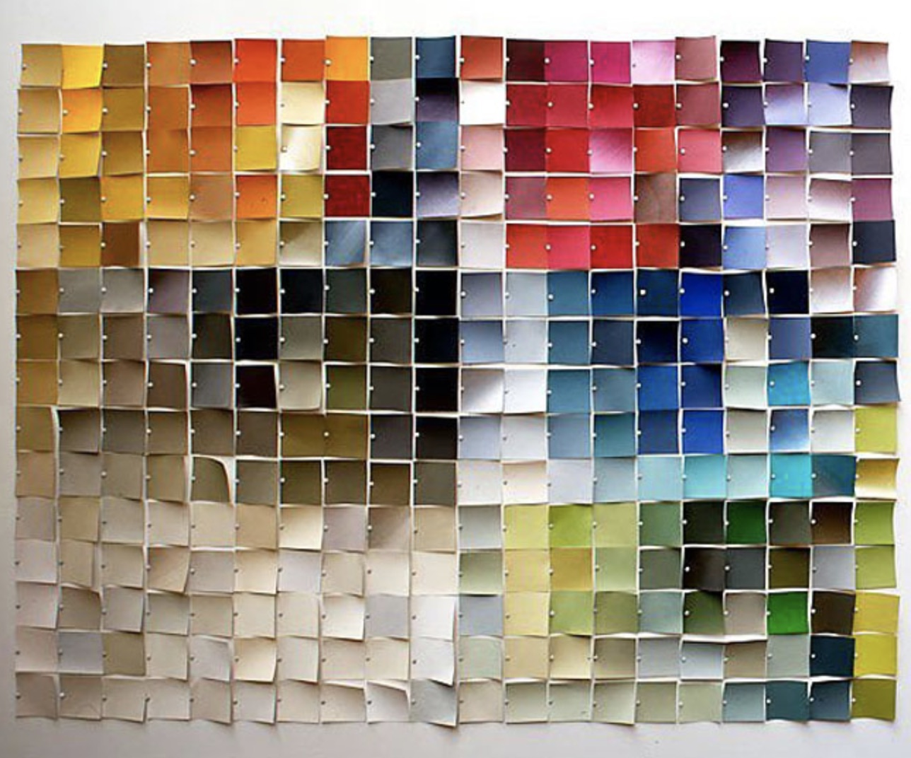
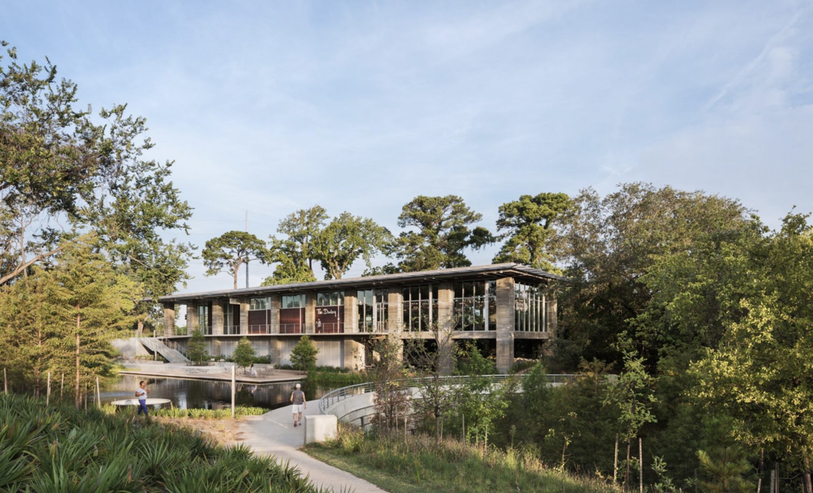
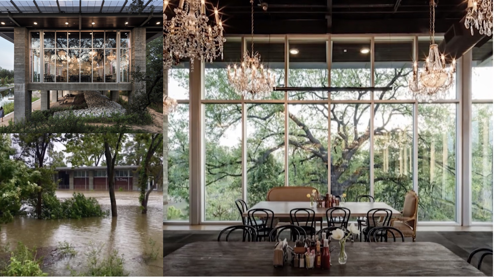

> “You must not come lightly to the blank page.”  — Stephen King

The blank page is the place where every problem can be solved, where the world of tomorrow can come into being, and where every creative endeavor can begin. This is a place where the singular beauty of art and science can either stand alone to enchant us or combine to transform our lives in ways that we never thought possible. The blank page itself is a muse. A quick Google, Pinterest, or Instagram search for a blank page will return admiring quotes from legions of creative, business, and scientific types about how there is no greater source of exhilaration, inspiration, or freedom than the blank page.
The blank page, however, is inanimate. It does not possess God-like or even human-like capabilities. It does not have a mind that acts of its own accord. It is a synthesized medley of chemicals that humans can impose their will upon. If you tried to impose your will on a blank page so you could create your masterpiece or solve the most daunting problems with no constraints could you? If you were like most people the question would intimidate and overwhelm you. You would struggle to focus and pick a place to start — let alone think creatively. This demonstrates what King said, you must not come lightly to the blank page. In order to realize the power of the blank page, you must impose your will on it and that is not something that you can do lightly or without purpose. In order to turn that blank page into a creative solution, you need a purpose for that page and purpose comes from one thing — constraint.

### Constraints Lead to Innovation

  

When creators are choosing their inputs for their work they like to think that they have unlimited choices. Our choice of either analog or digital inputs are presented in a way that makes creators think that they need an abundance of them to do their best work. This is because research shows that creators typically think a greater choice of inputs is always better because it allows for all possible creative solutions. Resources, however, are limited for any organization or individual. There is no feasible way to explore all possible creative solutions if you have seemingly infinite capital like Google or NASA or if you are a bootstrapped start-up in a garage. In order to create and innovate, every organization has to go against their intuition to try all possible methods and work within common constraints such as deadlines, budgets, and laws of physics. These constraints don’t leave creators and innovators in the dark about what could be, but they serve as a guiding light for the best creative thinking, innovation, and solutions.

Constraints acknowledge that any solution or outcome must recognize the limitations of current technology in order to advance it. These limits can be anything from what the maximum memory footprint of an application can be in order to run on most computers or how to land a rover on Mars with imperfect existing technology. These limitations shift a project from a moonshot with infinite possibilities to an experiment with fixed outcomes.

The best constrained creative thinking is iterative. Therefore, an experimental mindset where a creator can test and refine a hypothesisis critical to the success of creative projects. Once broad constraints such as budget, deadline, and laws of physics are established the creator can hypothesize about how they can use existing tools and technology to solve the problem as well as how to further inquire about what they don’t know in order to further refine the problem. This allows the creator to collect information by testing and researching different variables and technologies to understand what is feasible, viable, and desirable to the end goal of a project. By defining these variables, creators are able to shape and focus a design problem as a clear task to overcome. Thus, these constraints do not sacrifice what a project could be, but these constraints stimulate creators to be their most innovative and do their best creative thinking because the scope of the problem and the steps to solve it are crystal clear.

### Psychology and Constriants

  

An important aspect of the creative process is the enjoyment that the creator experiences and this is directly tied to the intrinsic motivation. Intrinsic motivation is behavior that occurs when you are motivated to find a solution for something without any external pressure or reward. Those who are intrinsically motivated are practically in a continuous state of curiosity. When you are intrinsically motivated to do something you could easily lose your sense of time because you are so engaged with it or would do something for free instead of being paid. This type of motivation thrives when creators have a high level of enjoyment, autonomy, competence and control about their creative process. While pure passion and interest in a subject can be seen as a motivator for this type of behavior, constraints can be equally powerful.

There is scientific evidence that too many choices causes stress, anxiety and an inability to focus and maintaining these emotions take up most of our cognitive capital. This leads to a decrease in both the enjoyment of a creative task and the intrinsic motivation to complete a creative task. This choice overload will result in suboptimal creativity because our mindset will not be one of continuous curiosity that is associated with enjoyment and intrinsic motivation, but of continuous anxiety, which is associated with too many choices and not enough constraints. In order to harness your mind’s creative power, you must make a decision to go against your intuition and constrain your inputs.

These constraints spur intrinsic motivation because they preserve your cognitive capital, force you to focus on a task, and enhance your enjoyment of the creative process. Common constraints such as deadlines, budgets, and limits on resources spur creativity because they direct our cognitive capital to only work on the project at hand as quickly and creatively as possible. This mindset gives us less time to ruminate on questions that cause stress and anxiety such as what if I had more time, more money, or more choices and spend more time focusing on designing a transformational solution. Research suggests that when creators have the ability to focus on specific creative solutions it enhances the enjoyment of the creative process. This in turn makes us more creative and gives us a better framework for executing a creative solution in practice. Constraint is thus the key psychological component to develop a unique creative solution.

### Buffalo Bayou Park

  

If you have ever been to Houston, Texas, you have seen the Buffalo Bayou. It is in central Houston and it is the floodplain where water drains after a hurricane, a flood, or another severe weather event. A few years ago, the city of Houston decided that it wanted to develop the Bayou into a park so that the 95% of the time that the city was not flooded the Bayou could be a place where you could enjoy hiking and biking trails, dog walking areas, cafes, and even festivals. Since Houston is a city that lies close to sea level and is prone to flooding, every aspect of the development of the area was constrained by one question — can this design survive when it floods?

This wasn’t an opportunity to design a traditional park with traditional buildings at ground level made out of traditional materials that would be damaged in a flood. This was an opportunity to use the limitations of the flood-prone environment to transform what the riverfront park experience could be. It became an opportunity to innovate because it shaped and focused the design problem with a clear challenge to overcome.

  

Instead of having buildings at ground level, the buildings were elevated and the underbelly was used as a shady place to escape the subtropical heat and humidity and as storage for kayaks and canoes to take out on to the Bayou. The elevated buildings were not a place to observe the Bayou running, but a place to see the vistas of the city around you and explore the foliage as if you were in a treehouse. The exterior of the buildings were made out of concrete patina so that it would not deteriorate or get marked up if debris hit when it flooded. When hurricane Harvey devastated Houston with flooding in 2017, the water in the Bayu rose 32 feet above the normal level. Thousands of homes and other properties were flooded, but Buffalo Bayou Park survived. Not a drop of water got inside the park buildings.

.............................

When we accept scarcity, constraint, regulations, and rationing and use them as a challenge to solve problems, we are able to advance science, culture and society, in ways that stand the test of time — or in the case of Buffalo Bayou Park a biblical flood. The world of tomorrow does not come into being because of a blank page, billions dollars, or thinking that we have infinite capabilities — it comes from the realization that in order to design a limitless future we have to limit ourselves in the present. Thus, constraints are not the boundaries of creativity, but the foundation of it.