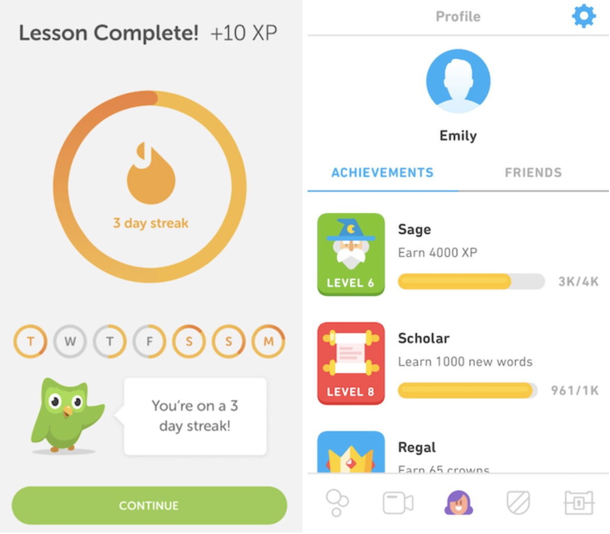

I remember telling a native Spanish speaker that even though I didn’t grow up in a house where it was spoken, I could say I speak Spanish because of four years of language classes and growing up in South Florida, where it is common. Then she started speaking to me in Spanish and I stopped dead in my tracks; I couldn’t understand what she is saying or respond with anything better than “Hola! Me llamo es Emily” or “Donde está el bano?” I realized that after four years of not speaking or even being around the Spanish language, I could not comprehend it like I once did. This led me to discover the app with which I’m obsessed: DuoLingo. I am absolutely obsessed with Duolingo — an app that teaches you how to learn a new language — because it is free, it uses data to personalize your learning experience, it encourages positive behavior change through gamification, and it gets you speaking the language through social and interactive features.

### Duolingo is Brilliant, Free and Disruptive

Through language, we express the human experience. Its beauty is it reflects the diversity of all 7 billion people on this planet through their various languages and their dialects; this allows your signature experiences to be expressed in a way that is exclusive to your culture. In the 21st century, learning more languages increases your opportunities for success. The problem is that traditional language learning gets harder as you get older and can be expensive once you leave school.

Duolingo solves these problems and finds perfect product market fit because its free lessons uses tested data-intensive methods that differ from traditional book and classroom learning. The result is an efficient — and *free* — method for language learning.

This type of disruption is a driving principle behind great companies and great products in our information economy, where there is no monopoly on access to information and where no one corporation, person, government or other entity benefits from a monopoly on access to information. Duolingo has leveraged this principle into a successful, impactful product that is the most downloaded education app in the world.

The versatility of free data-driven products is reflected in the depth and the breadth of DuoLingo’s users. Everyone from Bill Gates, to engineering students who literally dream about interviewing the world’s foremost paella experts in perfect Spanish so I can get their secret recipe (ME!), to public school students all over the world use DuoLingo because of its free, brilliant and disruptive dissemination of information.

### Data 

Every aspect of Duolingo’s product is rigorously tested through statistical methods. It collects data from at least 6 billion language lessons per month. This means every new feature is intentional and scientifically tested to help you learn better. It also is tailored to meet a student, whether it is a good or bad day, where her skills are.

One of my favorite new data-driven features is tips. In Duolingo I am more proficient in Spanish than in French. So my tips for French revolve around the sounds of words and letters, while those for Spanish revolve around how to use a word such as “hacer” in a different context. This feature has increased my learning tenfold because it has picked up on how I tend to use common words like “is” like they are used in English rather than using the Spanish equivalent. For example, I tend to enter (Es frio) rather than (hace frio). In French, tips remind me how to correctly spell words I tend to spell phontetically in as if it was in English such as, “om” instead of “homme”.

  

The collection and analysis of educational data are among the most important parts of Duolingo’s product. They allow Duolingo not just to be a vehicle for learning, but also a vehicle for learning *how* people learn. This enables DuoLingo to bring data to opinion fights and be a leader in ed-tech for years to come.

### Behavior Change (For the Better) through Gamification

All great products change your behavior, so you spend more time using the product and thus benefit the company. What sets Duolingo apart is that the more that DuoLingo changes your behavior, the more both you *and* the company benefit.

The app breaks down language learning into small concrete goals that can be met in 20 minutes a day or less. Small goals modify our behavior because they don’t intimidate us; it’s easy to find five minutes to play with an app. In Duolingo, a student meets these goals by maintaining streaks — this relies on the availability heuristic, the idea that you don’t want to lose something that will make you happy especially if you are reminded enough about it. Gamification and visualizations of success are crucial to keeping these streaks alive. Each time you correctly provide five answers in a row, Duo — the app’s adorable green bird mascot — gives you a congratulatory message. The streak you have achieved thus is visualized, and after completing a lesson, you can unlock other lessons and earn stars.

  

Duolingo uses gamification to give students incentives to change their behavior. Badges, stars, treasure chests, coins and even the use of ads reward behavior that uses the app and keeps the user learning new languages. All of these gamification features are permanent: You can lose a streak, but not a badge, stars or coins in app rewards. All of these features combined fulfill DuoLingo’s mission: to be an optimal ecosystem for positive behavior change.

  

### Social and Interactive Features

Languages are interactive, and learning one requires features that are more interactive than scrolling, swiping, and tapping a screen. Duolingo masterfully integrates the social and interactive aspects of language into every aspect of its product. Every lesson includes a speak-and-listen component that can be repeated, sped up or slowed down. What’s more, DuoLingo has a collection of ways students can become fluent that are more social and interactive than looking at your phone. There are online clubs, tutors and leaderboards where you can practice having conversations with other users at similar comfort levels. Duolingo ingeniously provides podcasts by native speakers so students can pick up cadences, emotions and pronunciations they can’t internalize by tapping a screen. It even sponsors meetups all over the world — even in Gainesville, Florida where I am based — where users can practice their new language and gain all of the connections and opportunities that come with learning a language.

After going to my first meetup in Gainesville, I officially fell in love with Duolingo. Through all of my interactions with the app — meeting small goals through deliberate practice, changing my behavior so I would practice 2 lessons a day, listening to DuoLingo podcasts, and interacting with the social components of the app — I was able to hold actual conversations in Spanish. I could say so much more than “Hola! Me llamo es Emily.” or "Donde está el bano?”.

  

### Duolingo Isn’t Perfect (Yet) And Here Are Two Features I Would Add To The App

Duolingo’s successes in and commitment to using data to gamify positive behavior change means it will continue to be a leader in creating an optimal ecosystem for language learning — there isn’t much room to grow there. However, I think Duolingo has room to grow in personalizing the user’s connection to the new language and the new culture. I think the best ways to personalize these connections are through virtual reality, augmented reality and lessons in specialized subject areas that are of particular interest to the user.

#### Virtual and Augmented Reality:

These are powerful tools for learning that allow students to immerse themselves in a concept and a culture. It could be an amazing experience to learn words about cities in French while being immersed in the streets of Paris, or learning how nature in Portugese while being immersed in the Amazon Rainforest. Virtual Reality can make that happen, and Duolingo should use it.

Augmented Reality also could help edify our understanding of our current environment in another language. For example, if a student was looking at a staircase and then wanted to know how to say “staircase” in Spanish, then AR could let the student interact what is in front of them, telling them the word is “escalera” and then prompting them to take a Spanish lesson about objects around the house. The ability to immerse yourself in a culture while making more connections to your current reality will vastly enhance user experience while learning languages.

#### Specialized Subject Areas:

We all are more willing to do things when we are intrinsically motivated, and with the rise of the internet, more of our interests are based in the cultures of other countries. We listen to K-pop lyrics from Korea, admire Anime from Japan and read classics such as Don Quixote in its original Spanish. That’s why DuoLingo should offer specialized lessons in areas that let people learn about those aspects of other cultures that interest them. It can leverage the interests students bring to their studies to strengthen their connections to the language, the ideas and the culture.

