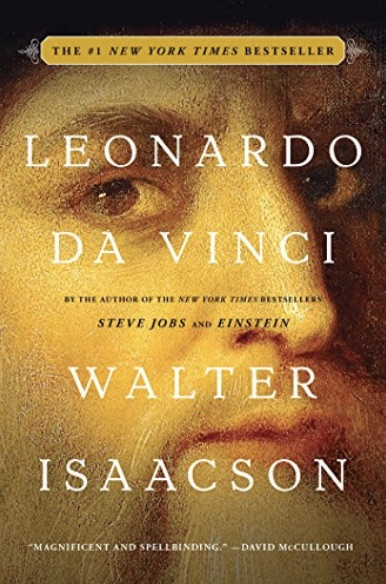
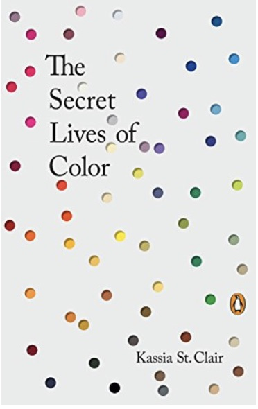
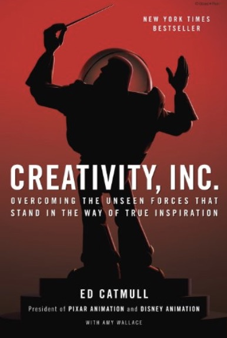
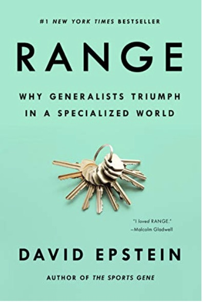
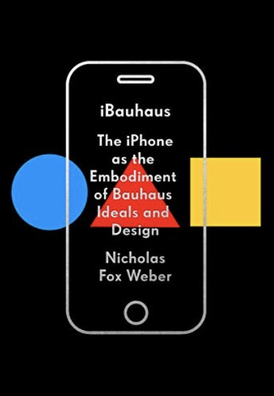

---
title: Five Great Books that Explore the Links Between Science and Creativity
author: Emily Elia
date: 2021-04-12
hero: ./images/sq.jpg
excerpt: Five Great Books that Explore the Links Between Science and Creativity 
--- 

I want you to close your eyes and imagine both a scientist and an artist. The scientist may be in lab gear working with equations and equipment to create something you couldn't begin to understand. The artist may don an eccentric look and be able to use oil and marble to create something you couldn't begin to understand. Both of these people seem different on the surface and make their living in completely different trades, but if you go a step deeper creativity is what connects them. This might even be worth exploring in a series of blogs (hint, hint). Here is a reading list to start this exploration!

### Leonardo DaVinci - Walter Issacson

  

"I can also paint." This sentance came from the man who painted the Mona Lisa and the Last Supper. Da Vinci's life shows that ideas are not one dimensional. Art, science, and technology all exist at the intersection of each other. In order for them to advance they all must feed off of each other. Da Vinci's life, art, science, writing, math, and his beloved military engineering are the best examples this and its impact

### The Secret Lives of Color - Kassia St. Clair

  

Color is the language through which we experience the world, but how we create and perceive colors is something that has vexed artists, scientists, and philosiphers for ages. A 24-year-old Issac Newton taught us that color is grounded in science when he used prisms to take wavelengths apart and put them back together again. Objects are different colors because they absorb different parts of the electromagnetic spectrum (remember your friend Roy G. Biv from middle school science). We experience color, however, through what we create and the values that we attach to those colors. A scientist made fluorescent pink in a lab, mauve became known as "menopausal mauve" because of its popularity with widows and older women.

### Creativity Inc. - Ed Catmull and Amy Wallace

  

Pixar is a company that sits at the intersection of art and science. It has been able to be a pioneer in the science of animation and the art of storytelling because creativity is at the heart of the organization. Founder Ed Catmull defines creativity as something simple - the unexpected connections between unrelated concepts and ideas. This type of creativity doesn't exist in a void, it is dependent on people and Catmull thinks it can thrive when a strong team that trusts each other isn't afraid to fail. That is how Pixar can be a place where science and art could change the world.

### Range - David Epstein

  

When it comes to developing expertise many think that starting early and racking up as many hours of deliberate practice as possible is the only path to becoming an expert. This is not the case. Many of the world's most creative and the world's top performers found their path later in life and can juggle many interests instead of focusing on one. Einstein was known to play the violin while working on the theory of relativity and Federer did not play tennis until he was a teenager. Studies of both artists and scientific inventors have shown that accumulating a range of skills and experiences resulted in more creative output and more earning potential. Thus, their creativity did not come from knowing one area deeply, but being able to see a broader picture and connect the dots.

### iBauhaus: The iPhone as the Embodiment of Bauhaus Ideals and Design - Nicholas Fox Webber

  

The Bauhaus was an early 20th century movement that revolutionized design. Their principles of form following function, materials that reflect the true nature of objects, favoring linear and geometric forms, adhering to line and shape, and most importantly the fusion of art and technology may have more power today than ever before because of Apple's design principles. Apple's ability to give so much power to Bauhaus principles nearly a century later shows that creativity and science aren't so far apart and that one can give another new power nearly a century after its inception.
