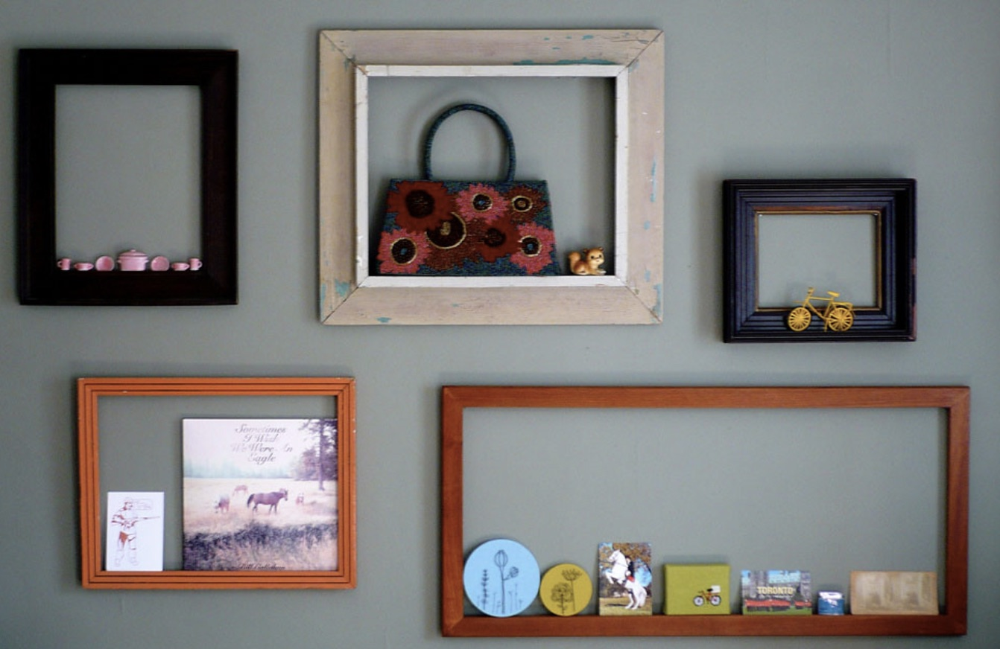
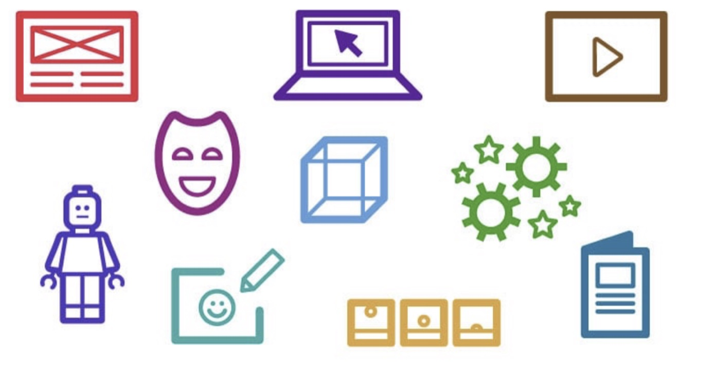

Creativity alone does not generate ready-for-market creations, ideas, or innovations. The creative genius, contrary to his mythologized portrayal, is not someone who is congenitally at odds with organizations, guardrails, or management, but is someone who thrives in these environments. Constraints, structure, and process are essential tools for creativity because they isolate and define the creative task at hand, which serves as a guiding light for creativity, innovation, and creative problem solving. Thus, management is not an obstacle for creativity, but a tool to help focus it so creators can bring their ideas, creations, and innovations to market.

Creativity is a process, and like any process, it is something that can be researched, managed, and measured in order to optimize its returns. Over the past few decades, research conducted into creativity and creative processes across a wide range of industries and disciplines has shown that there are recurrent patterns in creativity which make it simple to measure, manage, and replicate. These recurrent patterns occur in an iterative fashion across industries ranging from the technology to film and television. The recurring iterative patterns surrounding idea generation led researchers to distill the idea generation process into four key stages: inspiration, framing, prototyping, and validation.

### 1. Inspiration

  

The first step in the creative process is to search for new ideas. New ideas can come from anywhere so the creator should not hesitate to immerse themselves in a new world or a new setting. This enables their brain to overcome functional fixedness, a common cognitive bias, and to be able to see the world and the objects that make it up in new ways. This is not the only way to search for ideas. Another common way to find inspiration is to encourage teams to talk to each other and see if their collective cognitive might can come up with new ideas. Even though these are two common ways to find inspiration it is important to note that there is no one proper way to seek inspiration. In order to be inspired, the most important thing to do is to cultivate a mindset and environment of continuous curiosity which makes your mind more open to new ideas.

### 2. Framing

  

The second step in the idea generation process is framing. The framing process transitions an idea from the conceptual world in your head to the physical world where it can be shared with others. In this step you provide context for your idea and you define the direction that you want to take it. While framing your idea, it is common to go back to the inspiration stage to further refine or express your idea or concept. Framing can be done by writing down, sketching, or using other media to conceptualize your ideas so the conversation about where to take your idea next can begin.

### 3. Prototyping

  

Prototypes test if an idea is feasible by providing specifications for a tangible working product rather than a theoretical idea. This working model is used as a basis to evaluate ideas and determine if this design is good enough to be the final product or if other iterations need to be made. The prototype is not the final product, but it is used as a barometer to see if the inspiration and framing steps need to be revisited to further refine the idea. In this stage basic models, mock-ups, storyboards, and wireframes are built. These prototypes illustrate the structure by showing the physical form of the idea if it is an object, the synopsis if it is a written work, or wireframes and storyboards for a digital product.

### 4. Validation

  

Validation is the final step in the idea generation process. This step aims to select, reject, or modify, ideas or concepts generated in the previous stages. In order to be validated — an idea — which at this stage is usually a working prototype — must be rigorously tested by receiving feedback from potential users and other stakeholders. This feedback gives creators a more complete sense of their final output and if the prototype meets its intended goal. The validation process can either show that the creator needs to revisit the previous three steps to further iterate and refine their idea or demonstrate that their idea is complete and their prototype is now a success.

..............................

It is important to remember that these four stages are iterative and the creative process often involves going back to other stages if new information is discovered or if new questions arise. Since creativity is something that can be managed, it is important to keep these steps in mind when creating both a physical and mental environment where you can do your best creative work. Creativity is individualistic so every creative process will have its own subtleties, but every creative process will include these four steps.
