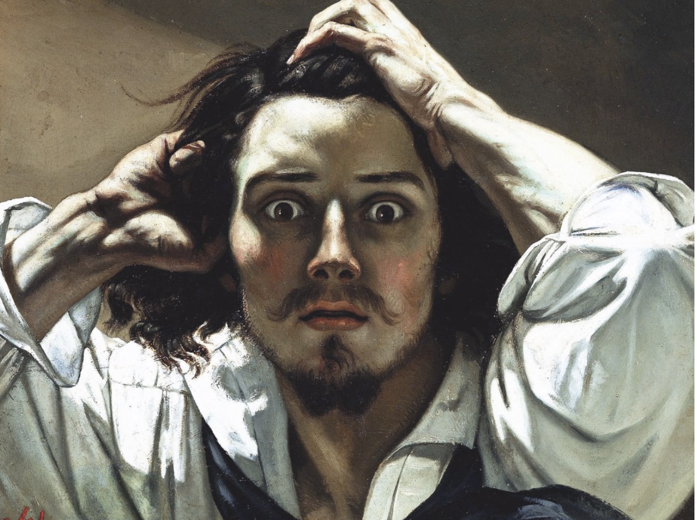
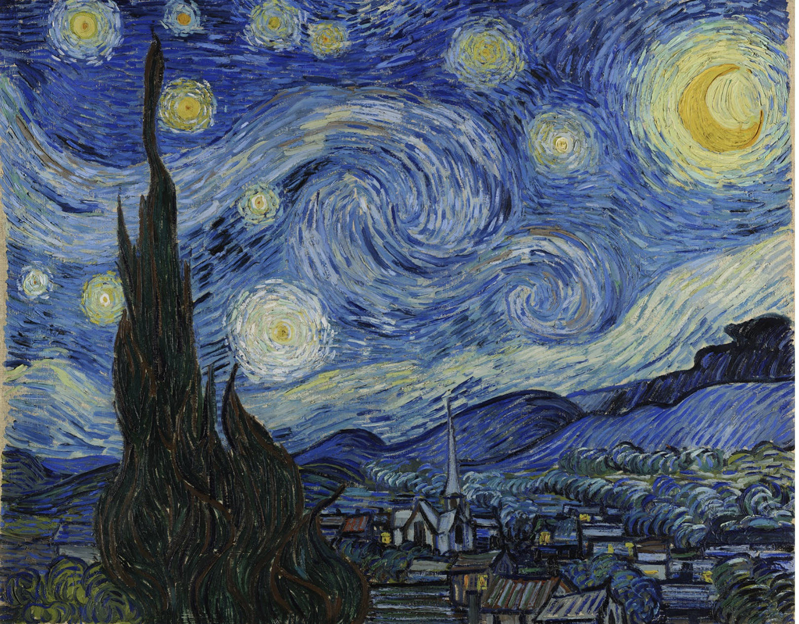

Genius is defined as “exceptional intellectual or creative power or other natural ability.” As the definition implies, geniuses have the power to transform, imagine, and most importantly create what is both novel and useful. The novel and the useful shift our scientific, artistic, societal, cultural, and paradigms and worldviews. What the word genius implies is remarkable, but in the context of those who history considers “creative geniuses” we don’t let the word and all of the power that it entails stand alone. “Genius” is always attached to a modifier and never one that connotes happiness, productivity, or well-being like “content genius”, “productive genius”, “thriving genius”, “effervescent genius” or “mindful genius.” We associate creative genius with terms such as “mad genius”, “insane genius”, “forsaken genius”, “suffering genius”, and “tortured genius.”

This archetype of the tortured creative genius is dangerous because it not only implies that genius is a direct result of misery but creativity — the ability to create something that is both novel and useful — is inaccessible to those aren’t dealing with mental health issues or those who have a dogged, perennial urge to start drinking absinthe or slice off an ear (seriously, don’t do this). This makes most of us fear the label of creativity because the vast majority of us have nothing to do with and don’t want to be associated with such reckless esoterics. Creativity — and the ability to have so-called genius ideas of your own — is something that is inherent in all of us and something that cognitive science shows we can learn through overcoming common cognitive biases and refuting common stereotypes. One of the most important stereotypes to refute is that the creative genius is an insane, miserable, tortured, and forsaken, creature. In fact, creators and creative geniuses do their best work when they are in a very different state.

### How We Got to the Tortured Genius

  

Equating creative genius with a form of suffering or torture dates back to ancient times when the brightest minds theorized creatvitiy was only bestowed on those who were possessed by the Gods. This mentality prevailed until the Renaissance when artists first signed their work — and by doing so they took ownership of their creative output. Around this time, the word “create” came into the English language in Chaucer’s, The Parson’s Tale, but the word “create” was still attributed to divine intervention. The Enlightenment was the first time the word create was explicitly credited to a human — albeit an extraordinary human such as DaVinci — source. It wasn’t until the 1990s that we started to seriously research creativity as a cognitive process we could measure. This means that until the very recent past, all of the writing and criticism that historians, scientists, and others relied about genius, creativity, and creative geniuses still mostly relied on ancient ideas — promulgated by generations of Romantics — that madness — divine intervention — was the source of all human creativity. This idea remains prevalent today, because 30 years of scholarship does not automatically replace hundreds of years of scholarship, but divine madness is no longer the only association with human creativity that we have.

### What All Creative Geniuses Have In Common

  

Research from the very recent past overwhelmingly shows one key trait among the most creative — intrinsic motivation. Intrinsic motivation is behavior that occurs when you are inherently interested in something, and motivated to find a solution for it without any external pressure or reward. When you are intrinsically motivated to do something you could easily lose your sense of time because you are so engaged with it or would do something for free instead of being paid. Those who are intrinsically motivated are in a practically continuous state of curiosity. They are more curious, more cognitively flexible, more open to new knowledge, and more willing to engage in non-traditional methods.

The most important human resource for creative output is cognitive capital — even geniuses have a limit on what their minds can handle. When we are stressed out, anxious, miserable, forsaken, or tortured most of our cognitive capital goes to maintaining these negative emotions. When this happens, you lose your sense of autonomy control and focus. Our brains are spurred by enjoyment. This means when we have a positive state of mind we can focus, retain our sense of autonomy and control, and thus be intrinsically motivated. This is the mentality where even the most tortured of creative genius did their best work.

Intrinsic motivation shows us that extraordinary output is born from ordinary intentions. Intrinsic motivation and the environment that it thrives in is not exclusive to a selective group either by genetics or luck. While positivity, curiosity, and self-directedness, can all be personality traits, learning how to excel at these things is something we all can do. Creativity is a cognitive process, and like all cognitive processes the more we train our minds to execute these processes the better we become at them. Cultivating and maintaining this ordinary mindset is what any genius — even the tortured ones — learned how to do at an extraordinary level.

### Not Because of But in Spite Of

  

Vincent Van Gogh is the archetype of the tortured creative genius. Van Gogh most likely suffered from mental health issues that had limited if any treatment in the late 1800s. His struggle with depression was not only seen in his letters and his writings, but also in his ill-advised decisions to cut off his ear and take his own life. This behavior has led many scholars to believe that his mental illness was the cause of his creative genius. The best of Van Gogh’s artistic output, however, took place in an environment different from where his depression thrived which made him more intrinsically motivated to produce extraordinary output.

Van Gogh only took up painting in the last nine years of his life and in less than a decade he produced 900 paintings. One year in particular was his most creative. From May of 1889 to May 1990 Van Gogh produced 150 paintings which was about one-sixth of his creative output. There was something unique about that year, Van Gogh voluntarily committed himself to Saint-Rémy-de-Provence — a mental asylum. This was after the ear incident. After this event, Van Gogh knew that he had to do something about “the sadness that will last forever.” By committing himself, he acknowledged that his mental illness was taking away the one thing that mattered to him and the only thing that motivated him — painting. During his stay in the asylum, he was more lucid, more comfortable, and more in control of his life and his art. This was the period where he created some of his most famous works such as Starry Night, Still Life: Vase with Irises Against a Yellow Background, and Enclosed Wheat Field with Rising Sun. This attempt to create a more positive environment gave him the intrinsic motivation that he needed to create on a genius level. Thus, Van Gogh’s creative genius was not because of his mental illness, but in spite of it.

Van Gogh is not the only tortured creative genius whose mental illness is seen as the cause of his creative output and not its greatest adversary. Woolf, Munch, and Fitzgerald and many others all had their creativity linked to their suffering. Like Van Gogh, their lowest points did not serve as an impetus for or come in the middle of their creative processes, but these lowest moments robbed them of their greatest joy — their ability to work. In order to create, they needed to be in environments where they would be intrinsically motivated to work hard, hone their craft, and master their technique. Thus, like Van Gogh, their creative genius was not because of their mental illness but in spite of it.

						       
   								........

Thomas Edison famously said that genius is 99% perspiration and 1% inspiration. This quote reiterates that genius is not simply the idea that our brains come up with, but the ability to get into the zone where you can do your best work. The hard work, the trial and error, and the discipline that it takes to take an idea and make it work is not the result of a mind in mental distress. In order to do their best work, creators of all stripes need to be in an environment where their talent and technique can thrive and not be stifled by a mental illness. The persperation from which genius is born does not come from misery, torture or, madness it comes from hard work and the intrinsic motivation that is a part of all of us.

So could we all be creative geniuses? I have no idea, but we can all be creative if we find the intrinsic motivation to do the hard work to make our ideas a reality. None of us will ever know what creative output we are capable of if we let stereotypes such as the trope of the tortured creative genius get in the way of our intrinsic motivation to get out and work to get to work. So let’s get out there and see what we can do!

