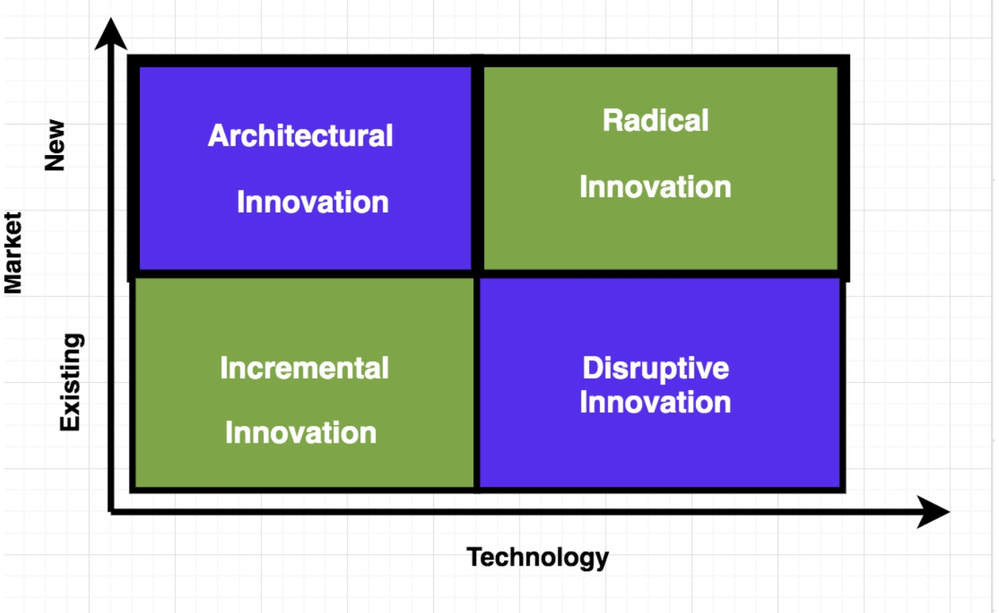
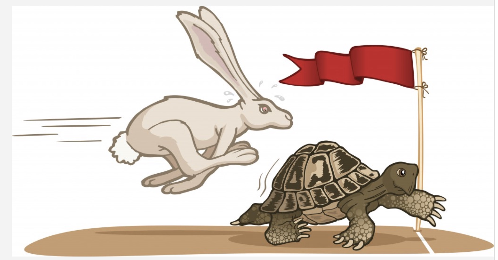

Most of us harbor a deep, dark secret: we are not prophets. We are aware that no amount of divine intervention, psychedelics, or listing new uses for a paper clip will give us the ability to know everything about the future and continually guide us from one paradigm shifting revelation to another. Since we are mere mortals who can’t raise their hands to part the Red Sea or give birth to the iPod, we automatically assume that we are unimaginative and don’t have the X-factor that makes a select, holy few us innovators and the rest of us middle managers and analysts. While it is correct to assume that we are not prophets, it does not mean that the ability to innovate is a lost cause for those of us who do not harbor the belief that they have an ability to foretell and forecast as if they were a prophet.

Since we don’t have the ability to part the waters, we need the ability to build a bridge. Thankfully, innovation, like bridge building, is a both process and a puzzle that can be researched, measured, and managed. Over the past few decades, research conducted into innovation across a range of disciplines has shown that there are recurrent patterns in innovation and these patterns separate themselves into four different types of innovation: incremental, disruptive, architectural, and radical. Each of these innovations solve different problems depending on the market, the technology, and the resources of a firm. Understanding the different types of innovation will give us the tools we need to build a bridge when we can’t part the waters.

  

### 1. Incremental Innovation

  

Incremental innovations are a set of small improvements or upgrades to a company’s existing products, services, or systems. These improvements do not bring a new product to market, but offer improvements to the product which help further differentiate it from the competition while building on current offerings. An example of incremental innovation would be the iPhone. Since 2007, neither the form nor the function of the iPhone has changed, but upgrades such as Face ID, camera improvements, and Retina display have improved the existing product. Thus a 13-year-old innovation can stay the cutting-edge luxury smartphone that it was at its inception, by updating its features instead of altering the original product.

Even though incremental innovation may not seem exciting as its more radical and disruptive counterparts, there are many benefits that come from prioritizing and investing in these innovations. Incremental innovations give organizations a safe source of revenue because they are not betting all of their time, energy, and resources on all-or-nothing radical innovations that rely on consumers changing their behavior to adjust to a new reality. By investing in incremental innovations to beloved products or services, organizations make a more consistent bet that consumers will flock to a new and improved version of something that is an essential part of their lives. This gives products a sense of longevity by prolonging its market life. Your market stays interested in that product because they will want to improve on what they have rather than move on to the next shiny object when they get bored with a current iteration of that product.

### 2. Disruptive Innovation

  

Disruptive innovation refers to a process in which new entrants successfully challenge incumbent firms, often in spite of inferior resources. This process takes hold in two types of markets that large incumbent firms typically overlook: low-end footholds and new-market footholds. New entrants can dominate in low-end footholds because incumbent firms will devote resources to ensuring that their most profitable customers have new and improved products and services, instead of paying attention to what less profitable customers want. This allows a disruptor to get their foot in the door by providing these ignored customers with a good enough product. In new-market footholds, disruptors create a new market which turns non-customers into customers. Contrary to the lore of disruption, it is not solely about a lone genius and his technology, but it is a process that sits at the intersection of technology and business model innovation.

Though the word disruption is overused, disruptive innovation is a process that turns B-list brands into behemoths in every industry. Netflix is a great example of disruptive innovation. Netflix originally began as a movie rental business, that mainly appealed to film nerds, and did not have the same broad appeal that Blockbuster did. With the rise of new technology that made streaming accessible to a broad market, Netflix was able to grow its business by offering thousands of movies and TV shows to stream at the tip of your finger for less than the cost of a trip to the movie theater.

The initial foothold in the low-end film nerd niche market made Netflix disruptive, which then allowed Netflix to experiment with a new business model that eventually became attractive to Blockbuster’s core customers due to changes in the way that movies, video, and TV were consumed. Netflix was founded in 1997 and Blockbuster went bankrupt in 2010. Thus, it is important to remember that disruption is a process that takes time. Incumbents frequently overlook disruptors because they tend to see that product or service as a fixed, non-threatening point in time, rather than the threat that a disruption could become as technology and consumption habits change.

### 3. Architectural Innovation

  

An architectural innovation reconfigures the overall design of a system or the way its components interact. These innovations take lessons from various processes and previously existing technology and apply them in a different manner. Thus, components that may not be innovative alone or as a part of another product or system can be combined into a new product, service, or system that is innovative. A key component architectural innovations is that they destroy the usefulness of a company’s architectural knowledge, but they preserve the usefulness of their components — a physically distinct portion of a product that represents an essential design concept and performs a well-defined function — so these physical components can find a new life in a new innovative product.

Architectural innovations are everywhere. Memory foam came from NASA aiming to fix the safety of aircraft cushions with a new type of foam that would spring back slowly. This was initially marketed as medical equipment before mattress manufacturers reconfigured it so memory foam could be in bedrooms all over the world. The multi-core processors that power every computer, tablet, and smart phone are architectural innovations. Chip makers ran into roadblocks with single-core processors because they could not handle the complexity of modern computing. Instead of attempting to redesign the chip, these manufactures reconfigured their circuits so more than two chips could operate and connect to each other in the same circuit. This ensured that computing devices could have the processing power needed to handle maximal complexity.

Architectural innovations are successful because they are a low-risk high-reward strategy. They have tremendous power to transform markets because they allow organizations to destroy what does not work and transform what does work into something that can change how we live and work.

### 4. Radical Innovation

  

Radical innovations are spurred by the creation of new knowledge and the commercialization of novel ideas, products, or services that usually replace an existing idea, product, or service. This type of innovation is rare and relies on organizational capabilities and human capital because they focus on displacing existing products, creating new product categories, or changing the relationship between customers, businesses, and suppliers. These types of breakthroughs rely on both human and organizational ingenuity which thrive when there is a productive, empowering, and symbiotic relationship between innovators and their environments.

Radical innovation is what we imagine when we think about innovation. It is the invisible string that connects the destruction of old industries, technologies, and ideas to the revolutions that gives life to new industries, technologies, and ideas which shape the consumer landscape for years to come. As intoxicating as radical innovation may seem, it is a high-risk strategy. Radical innovation not only relies on dreaming up novel technology that we barely have the language to comprehend, but it also depends on this technology being such a remarkable force in the consumer landscape that it will forever change consumer behavior, create a new status-quo, and obliterate existing markets, just as cars did to horse-drawn carriages. A change of this magnitude never happens on a whim and even the best-laid plans for this radical change can fail. Thus, the level of risk involved in radical innovation demands a proportional level of caution, but with the proper amount of courage, patience, and vision, these innovations will reap the greatest reward.

......................................................

Einstein wisely said: “We can not solve our problems with the same thinking we used when we created them.” This adage applies to creativity and innovation because the type of thinking that gets any individual or organization into an innovative rut is not going to get them out of it. We don’t have the ability to part the Red Sea or predict the future, but we do have the ability to change course when something isn’t working. Innovation is the process of learning about your resources, strengths, and weaknesses and using that information to devise a strategy which produces a product, idea, or service that will make a measurable impact. Mastering that process gives anyone the power to change the world.