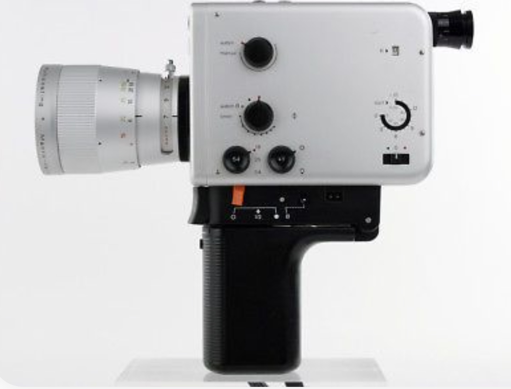
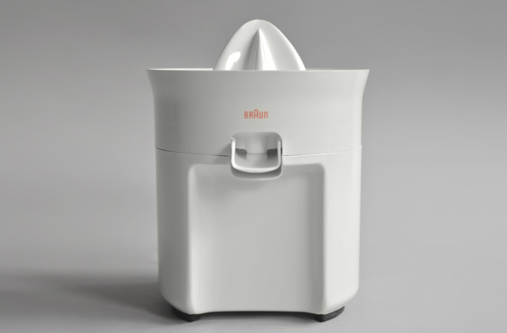
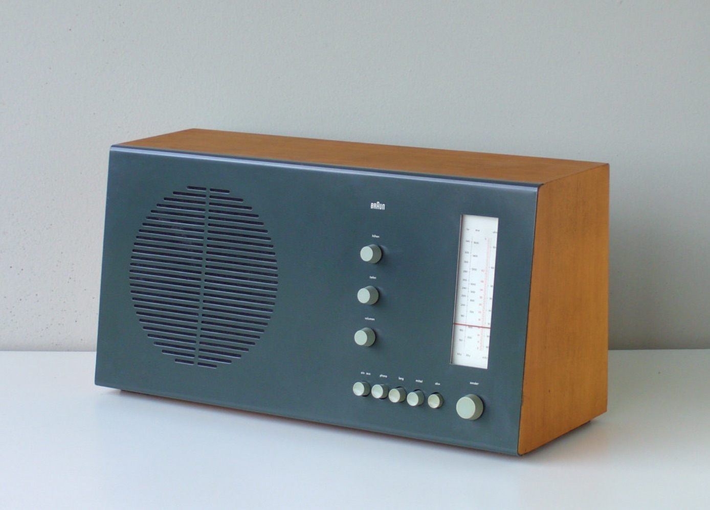
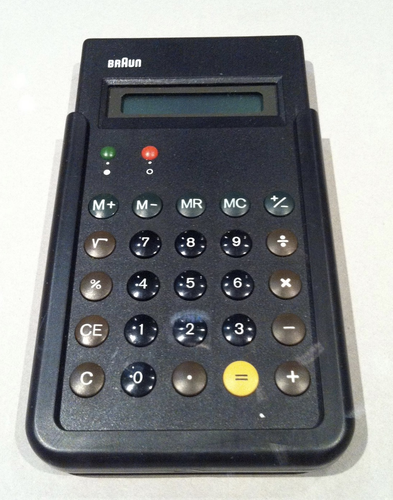
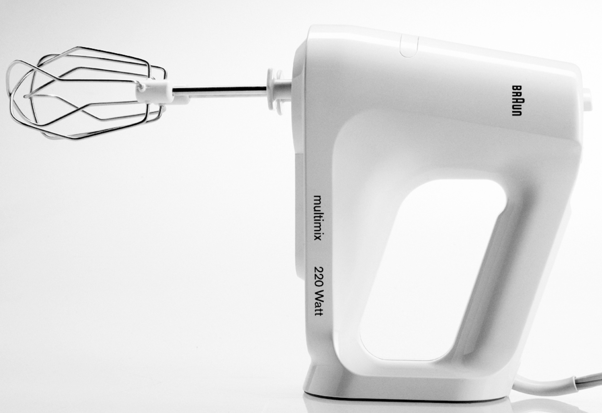
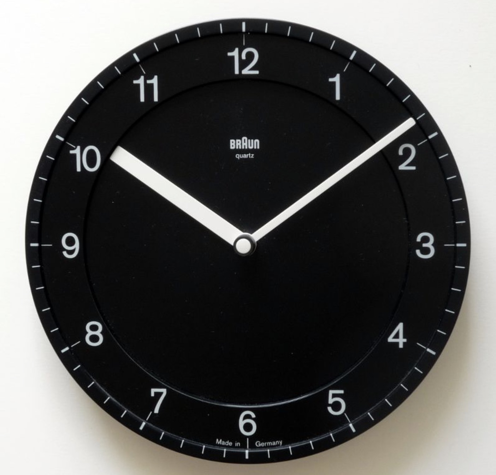
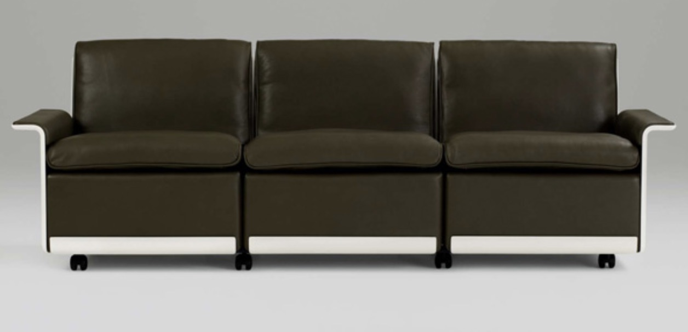
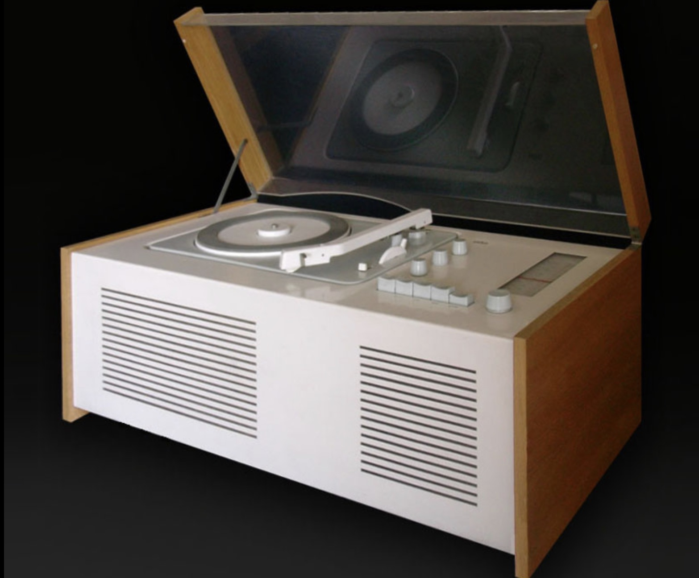
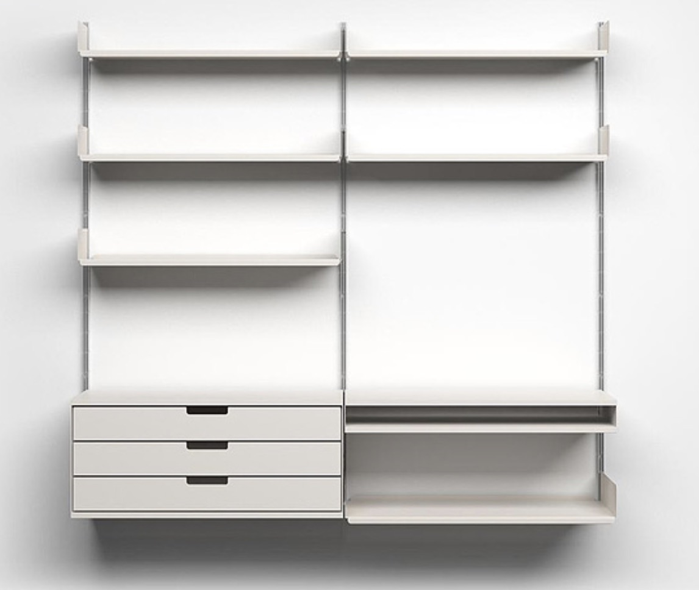
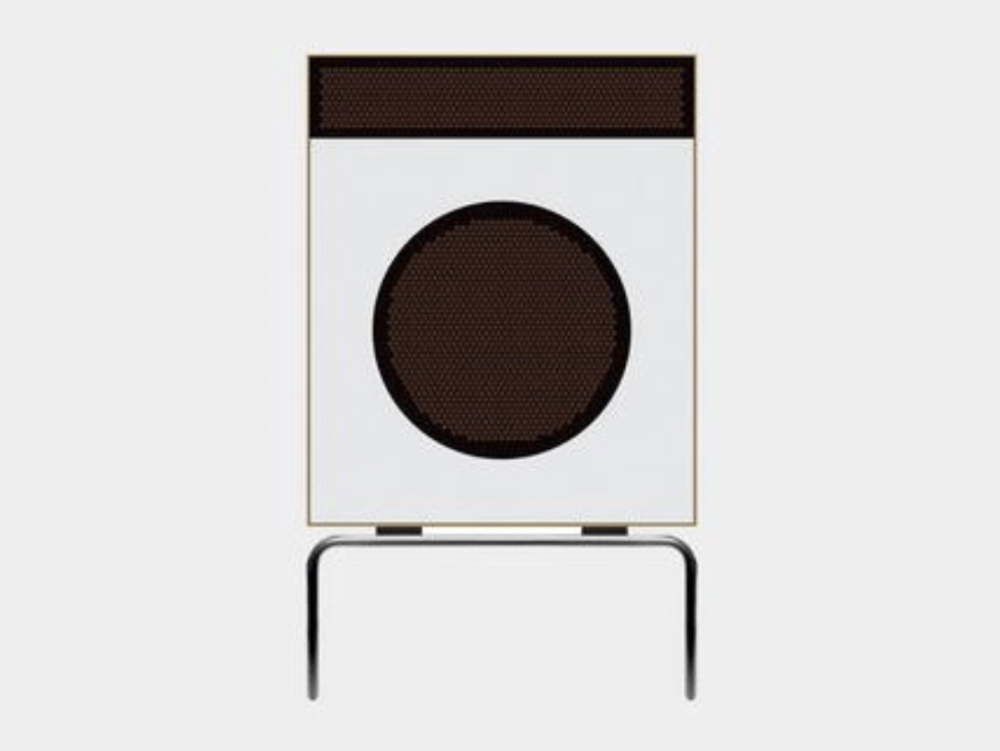

The mid-to-late 20th century may seem like a forgettable or even ancient time, depending on how old you are, but a revolution took place in the histories of technology and industrial design. During this mostly peaceful and prosperous time in the West — technology — in the mid-to-late 20th century sense of the word — became an ubiquitous part of our lifestyle, lexicon, and culture. Technology ranging from electric mixers, to record players became symbolic of the rising middle class. These devices made it normal, exciting, and aspirational to collect and upgrade the latest gadgets that made our lives easier and more interesting. This revolutionized consumerism and technology because technology was no longer something to be consumed by the very rich or designed for an obscure government lab. Machines became an integral part of our lives through designs that were accessible to all and controlled with our fingertips. Once these machines became a part of our daily lives there was no going back. Putting a coffee maker and an answering machine in every house and workplace led to putting a personal computer, the Internet, and quasi-intelligent machines, such as digital assistants, in every house and workplace. The designs of mid-to-late twentieth century consumer products are what links BauHaus to Clubhouse and they originated from one man.

Dieter Rams was the head of design for the consumer products company Braun from 1961–1995. During his tenure at Braun, Rams and his team led the development of products such as, Calculator Braun ET66, SK 61, and Sixtant SM2. These products that were created under the mantra of “less, but better” which came to epitomize the revolutionary but user-friendly products that made machines a permanent part of how we live and work. After Rams stepped down in 1995, his design legacy continued with the rise of the personal computer and the Internet. Since Rams’s principles of design made a technological revolution something you could access with your fingertips, his ten principles guided by “less but better”, found a second life in the digital world through UX, computer graphics, and graphic design. As the analog and digital worlds become more integrated, it is important to understand Rams’s principles so we can continue to design a world where the difference between you and a technological revolution is the tip of your finger.

## The 10 Principles of Design

### 1. Good Design is Innovative

  

The possibilities for innovation are not, by any means, exhausted. Technological development is always offering new opportunities for innovative design. But innovative design always develops in tandem with innovative technology, and can never be an end in itself.

### 2. Good Design Makes a Product Useful

  

A product is bought to be used. It has to satisfy certain criteria, not only functional but also psychological and aesthetic. Good design emphasizes the usefulness of a product while disregarding anything that could possibly detract from it.

### 3. Good Design is Aesthetic

  

The aesthetic quality of a product is integral to its usefulness because products are used every day and have an effect on people and their well-being. Only well-executed objects can be beautiful.

### 4. Good Design Makes a Product Understandable

  

It clarifies the product’s structure. Better still, it can make the product clearly express its function by making use of the user’s intuition. At best, it is self-explanatory.

### 5. Good Design is Unobtrusive

  

Products fulfilling a purpose are like tools. They are neither decorative objects nor works of art. Their design should therefore be both neutral and restrained, to leave room for the user’s self-expression.

### 6. Good Design is Honest

  

It does not make a product more innovative, powerful or valuable than it really is. It does not attempt to manipulate the consumer with promises that cannot be kept.

### 7. Good Design is Long-Lasting

  

It avoids being fashionable and therefore never appears antiquated. Unlike fashionable design, it lasts many years — even in today’s throwaway society.

### 8. Good Design is Thorough Down to the Last Detail

  

Nothing must be arbitrary or left to chance. Care and accuracy in the design process show respect towards the consumer.

### 9. Good Design is Environmentally Friendly

  

Design makes an important contribution to the preservation of the environment. It conserves resources and minimises physical and visual pollution throughout the lifecycle of the product.

### 10. Good Design is Minimal

  

Less, but better — because it concentrates on the essential aspects, and the products are not burdened with non-essentials. Back to purity, back to simplicity.
